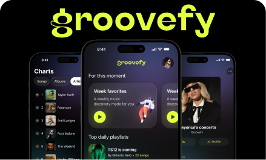
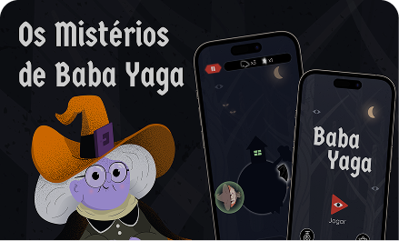
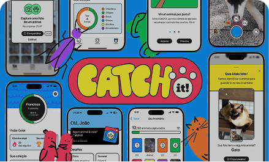

<!-- 🧠 Header Animation -->

  

  A developer driven by a passion for overcoming challenges, telling stories, and spreading knowledge.

  
  
  
  
  
  
  

- 🎓 Computer Engineering undergraduate (5/10)
- ☕️ CocoaHeads Fortaleza's member
- 🍎 Apple Developer Academy's Alumni

##  Featured Projects

<table>
  <tr>
    <td valign="top" align="center" width="280">
      
      <h3>Groovefy</h3>
      

      Personalized musical journeys based on moments in your life.
      

      
    </td>
  <td valign="top" align="center" width="280">
      
      <h3>Baba Yaga</h3>
      

        A magical orbital adventure inspired by Slavic folklore.
      

      
    </td>
   <td valign="top" align="center" width="280">
      
      <h3>Catch It!</h3>
      

        Species recognition with a focus on animal life.
      

      
    </td>
  </tr>
</table>

##  Connect with Me

  
  

